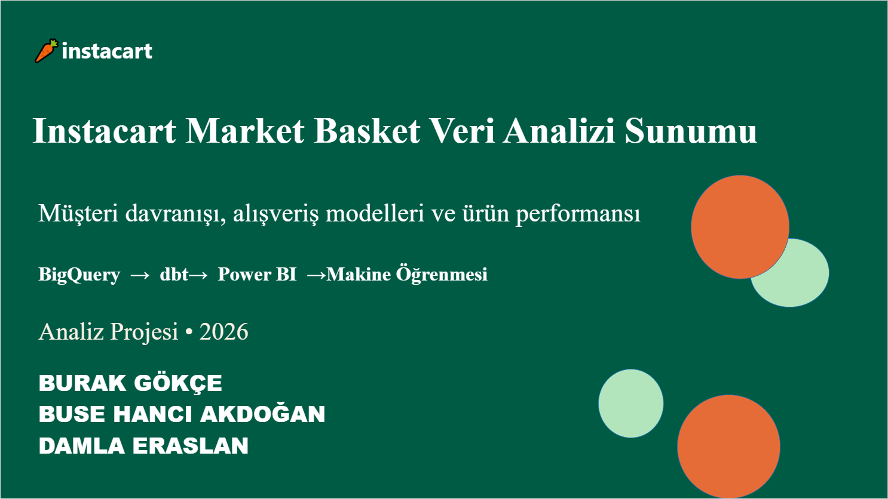
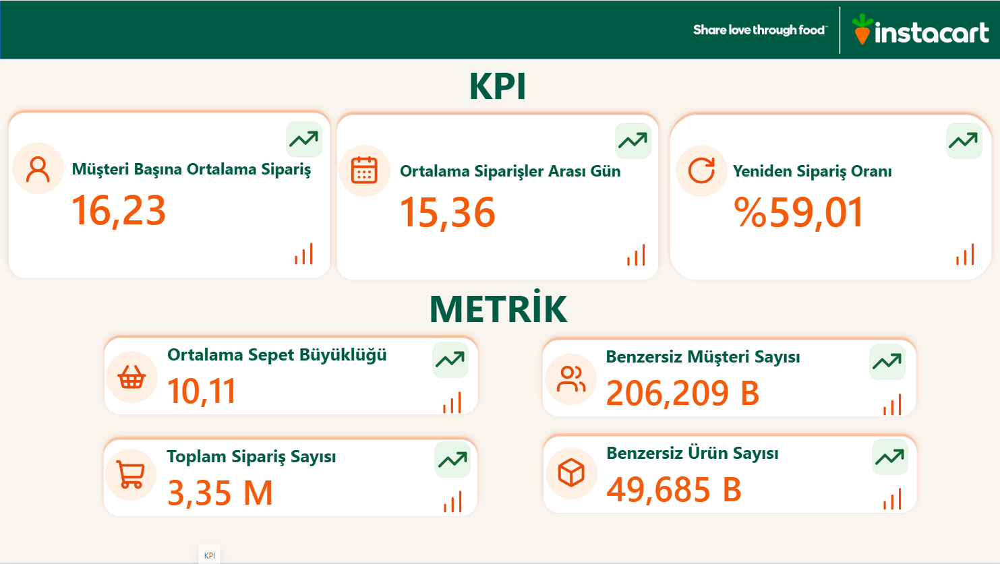
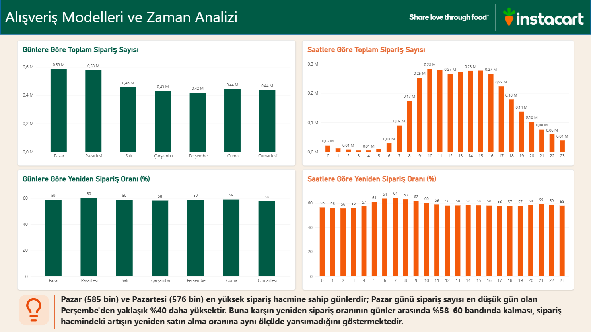
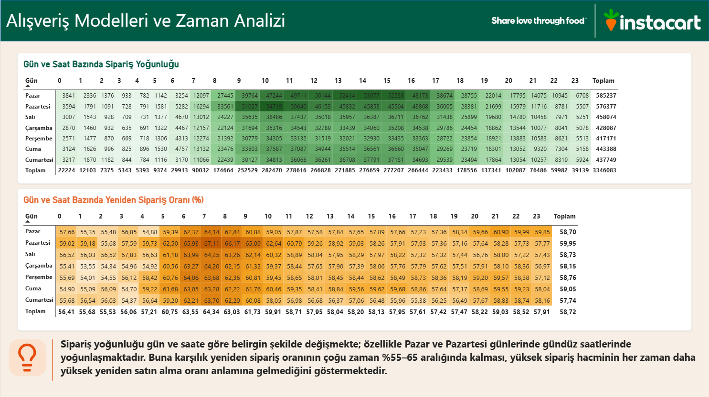
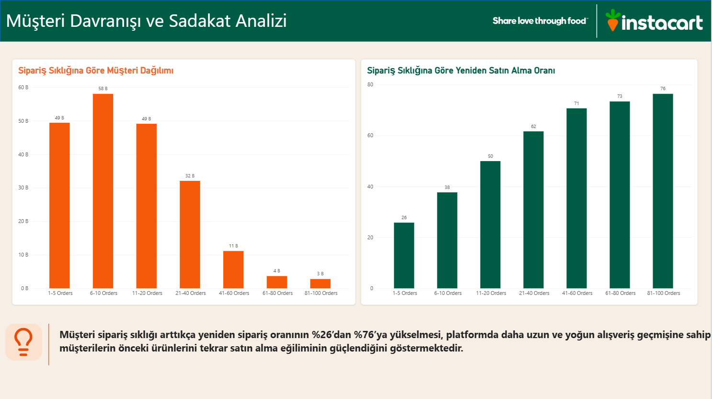
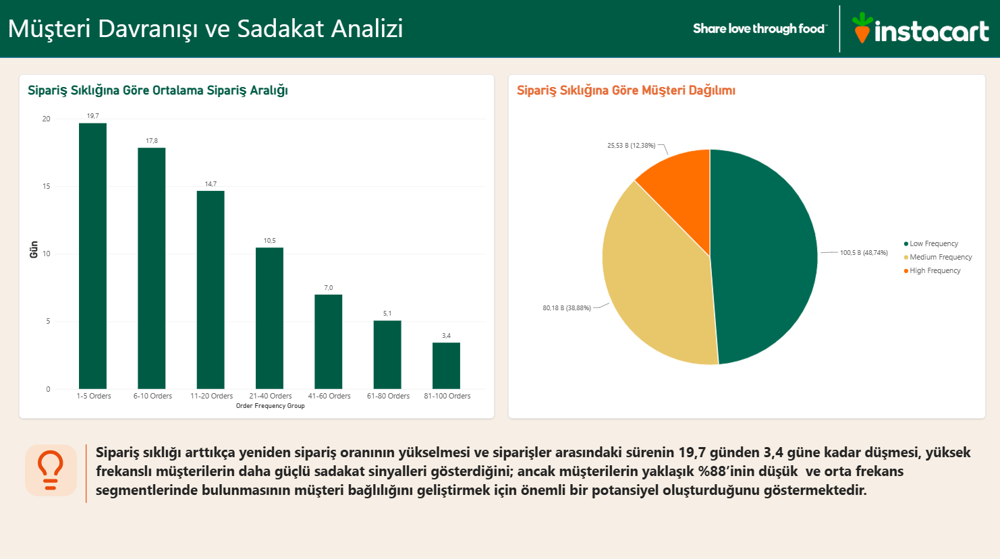
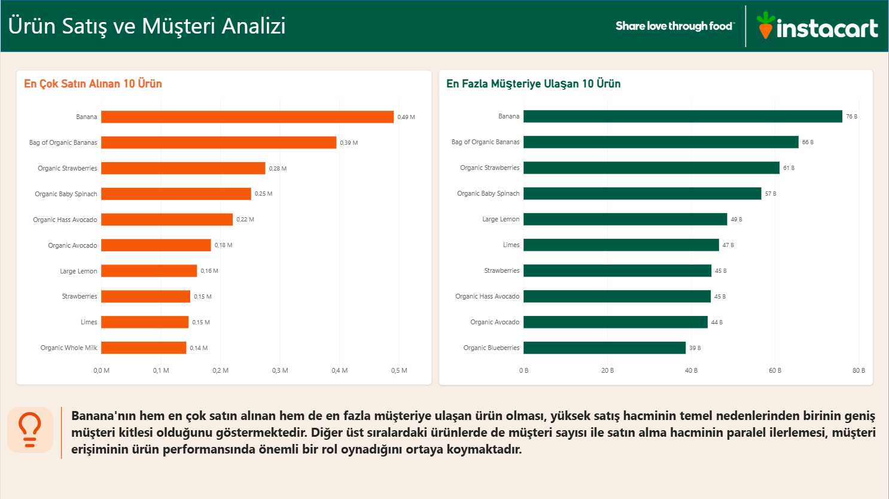
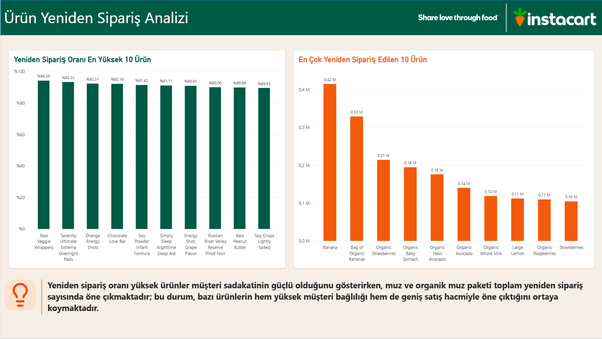
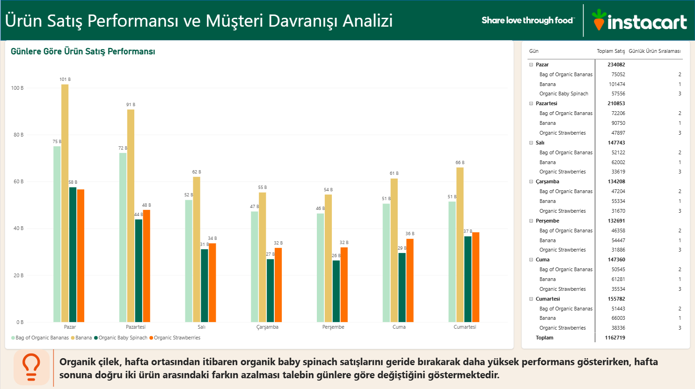
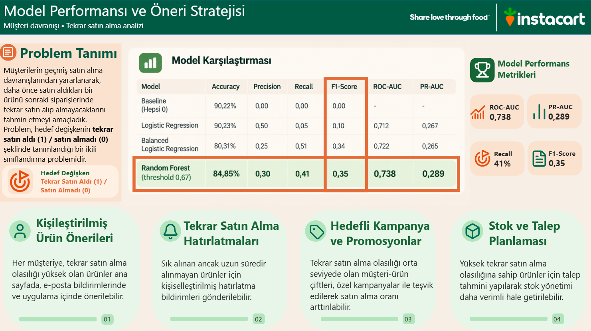

# Instacart Veri Analizi
> BigQuery · dbt · SQL · Power BI · DAX · Python

Instacart alışveriş verileri kullanılarak müşteri davranışları, sipariş alışkanlıkları, ürün performansı ve yeniden sipariş eğilimlerinin analiz edildiği Power BI projesidir.

## Proje Hakkında

Bu projede Instacart verileri üzerinden farklı boyutlarda veri analizi ve görselleştirme çalışmaları gerçekleştirilmiştir.

Analiz kapsamında:

- KPI'lar ve temel performans göstergeleri
- Siparişlerin zamansal dağılımı
- Müşteri davranışları ve sadakat göstergeleri
- Ürün ve satış performansı
- Yeniden sipariş davranışları
- Müşteri ve ürün ilişkileri
- Analiz sonuçlarına dayalı iş önerileri

incelenmiştir.

## Kullanılan Teknolojiler

- **Google BigQuery** – Verilerin depolanması ve SQL ile sorgulanması
- **dbt** – Veri temizleme, dönüştürme ve tabloların birleştirilmesi
- **SQL** – Veri sorgulama ve veri hazırlama
- **Power BI** – Veri görselleştirme ve interaktif dashboard oluşturma
- **DAX** – KPI ve analiz metriklerinin oluşturulması
- **Python** – Machine Learning ve tahminleme çalışmaları
- **Veri modelleme**
- **Veri görselleştirme**
- **KPI analizi**
- **Müşteri ve ürün analizi**

## Veri Analizi Süreci

Proje kapsamında uçtan uca bir veri analizi süreci gerçekleştirilmiştir:

### 1. Veri Aktarımı – BigQuery

Ham veriler **Google BigQuery** ortamına aktarılmış ve analiz için sorgulanmıştır.

### 2. Veri Temizleme ve Dönüştürme – dbt

**dbt** kullanılarak:

- Veri temizleme işlemleri gerçekleştirildi.
- Tablolar dönüştürüldü.
- İlgili tablolar birleştirildi.
- Analiz için kullanılabilecek veri modelleri oluşturuldu.

### 3. Veri Görselleştirme – Power BI

Hazırlanan veri modelleri **BigQuery üzerinden Power BI'a** aktarılmıştır.

Power BI kullanılarak:

- KPI'lar oluşturuldu.
- Müşteri davranışları analiz edildi.
- Ürün satış performansı incelendi.
- Sipariş alışkanlıkları analiz edildi.
- Yeniden sipariş davranışları incelendi.
- İnteraktif dashboardlar oluşturuldu.

### 4. Machine Learning – Python

Projenin son aşamasında **Python kullanılarak Machine Learning çalışmaları** gerçekleştirilmiştir.

Elde edilen Machine Learning sonuçları Power BI raporunun son bölümünde sunularak, veri analizi ve makine öğrenmesi çıktıları birlikte değerlendirilmiştir.

## Rapor Sayfaları

Power BI raporu aşağıdaki bölümlerden oluşmaktadır:

1. Instacart | Proje Özeti
2. KPI
3. Alışveriş Modelleri ve Zaman Analizi
4. Müşteri Davranışı ve Sadakat Analizi
5. Ürün Satış ve Müşteri Analizi
6. Ürün Yeniden Sipariş Analizi
7. Ürün Satış Performansı ve Müşteri Davranışı Analizi
8. Sonuçlar ve İş Önerileri

## Dashboard Görselleri

### Proje Özeti

### KPI Analizi

### Zaman Analizi

### Müşteri Analizi

### Ürün Analizi

### Sonuçlar ve İş Önerileri

## Power BI Raporu

Projenin Power BI dosyası:

`Instacart-Veri-Analizi.pbix`

> `.pbix` dosyasını görüntülemek için Power BI Desktop gereklidir.

## CV'de Kullanım

**Instacart Veri Analizi | BigQuery · dbt · Power BI · Python**

Instacart verileri üzerinde BigQuery ve dbt kullanılarak veri temizleme ve modelleme, Power BI ile veri görselleştirme ve Python ile Machine Learning çalışmaları gerçekleştirilen uçtan uca veri analizi projesi.

**GitHub:**  
https://github.com/busehanciakdogan/instacart-data-analysis-powerbi

---

*Workintech eğitim projesi.*